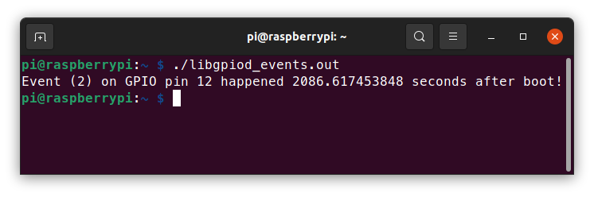

# Quick introduction to libgpiod

The old way of accessing GPIO pins from userspace using `sysfs` has been recently deprecated (see [https://www.kernel.org/doc/html/latest/admin-guide/gpio/sysfs.html](https://www.kernel.org/doc/html/latest/admin-guide/gpio/sysfs.html) for more informations about it).
As a replacement the kernel provides a new userspace ABI in the file `linux/gpio.h`.  

The library `libgpiod` encapsulates the new userspace ABI and provides a lot of functions that are easy to use and powerful.
You can find more informations about the project on the official repository here: [https://git.kernel.org/pub/scm/libs/libgpiod/libgpiod.git/about/](https://git.kernel.org/pub/scm/libs/libgpiod/libgpiod.git/about/).

## Before starting

As of the time of writing (30/12/2021), `libgpiod` is not packaged by default on Raspbian Bullseye, it needs to be installed manually.

```sh
# Install libgpiod for development
sudo apt install libgpiod-dev 
# Install gpiod which provides useful tools
sudo apt install gpiod
```

When distributing programs compiled with this library one needs to be careful to tell the user to also install the library, otherwise the program will not run!  

```sh
# Install the library
sudo apt install libgpiod2
``` 

| Warning                                                       |
| :------------------------------------------------------------ |
| Packages may be named differently on your linux distribution! |

## Basic Use 

The first thing to do before we can have fun with the GPIO pins si to select which GPIO chip we are going to use. 
The package `gpiod` provides a useful tool called `gpiodetect` which gives a detailed list of all GPIO chips present on the device.


In this case the Raspberry Pi 4 has 2 GPIO chips, one from the BCM2711 SoC (`gpiochip0`) where all pins from the header are connected and the second chip where system buttons and leds are connected (`gpiochip1`).

There is also the tool `gpioinfo` which gives a detailed view of all GPIO lines (or pins if you prefer) on each chip.


In this example we are going to make a very simple program that generates a square waveform, basically we are going to set the same pin HIGH then LOW in an infinite loop.

| Note                                                      |
| :-------------------------------------------------------- |
| The code below is not complete and needs to be completed! |


First we need the required headers.

```c
/* We need to include our library */
#include <gpiod.h>
/* This header will help troubleshoot problems and provides the function perror which is very useful */
#include <errno.h>
```

We can now open the GPIO chip and reserve the GPIO line we need.

```c
/* Open gpiochip0 */
struct gpiod_chip *chip = gpiod_chip_open("/dev/gpiochip0");

/* It is of good practice to check whether our calls worked */
/* Later, those checks will be omitted for simplicity's sake, please do not forget them in your code */
if (chip == NULL) {
        perror("unable to open gpiochip0");
        exit(EXIT_FAILURE);
}

/* We will use the GPIO pin 12 */
const unsigned int gpio_pin = 12;

/* Retrieve the GPIO line we want */
struct gpiod_line *line = gpiod_chip_get_line(chip, gpio_pin);

/* Reserve the GPIO line for us, also set the direction to output and set the default output to 0 (LOW) */
/* The argument "consumer" is a string that will appear in gpioinfo, it is used to tell which program is using the line */
gpiod_line_request_output(line, "our example name", 0);
```

At this point, we have reserved the GPIO pin 12 for our program. 
If another process tries to access the pin it will fail as we are already using it.

```c
/* Now we can generate the waveform */
for (;;) {
        /* Set output to LOW */
        gpiod_line_set_value(line, 0);
        /* Set output to HIGH */
        gpiod_line_set_value(line, 1);
}
```

And the final thing that is necessary before we can run it is to release all used lines at the end.

```c
/* Release requested line */
gpiod_line_release(line);
/* Close access to the GPIO chip */
gpiod_chip_close(chip);
```

Using a logic analyzer we can observe the resulting square waveform.


For using a line as an input it is the same thing, open the chip, retrieve a line, reserve the line and set the direction.
You can use `gpiod_line_get_value` this time to read the value of the pin (HIGH or LOW).

As a side note, it is also possible to skip the `gpiod_chip_get_line` function altogether by using the function `gpiod_line_get(const char *device, unsgined int offset)`.

| Warning                                                                                  |
| :--------------------------------------------------------------------------------------- |
| However, you **still** need to close the corresponding GPIO chip with `gpiod_chip_close` |

```sh
const int gpio_pin = 12;
struct gpiod_line *line = gpiod_line_get("/dev/gpiochip0", gpio_pin);
```

## Events

The library supports the three possible events on a GPIO line: **rising edge**, **falling edge** and **both edges**.

A small tool is also provided to monitor events on different lines: `gpiomon`.


Using the library to watch for an event is very similar to how you would request a line as input. 
You first need to open a GPIO chip, retrieve the line (or set of line with *_bulk*) on which you want to watch for events,
then you can request that these lines be watched using the `request` functions.
Now you can use the `gpiod_line_event_wait` and `gpiod_line_read` functions to trigger actions.

In the following example we are going to watch the GPIO pin 12 for a falling edge event.

| Note                                                                                        |
| :------------------------------------------------------------------------------------------ |
| The code below is not complete and needs to be completed, do not forget to check for errors! |

We first open the GPIO chip on which we will get the line we want.

```c
/* Open gpiochip0 */
struct gpiod_chip *chip = gpiod_chip_open("/dev/gpiochip0");

/* We will use the GPIO pin 12 */
const unsigned int gpio_pin = 12;

/* Retrieve the GPIO line we want */
struct gpiod_line *line = gpiod_chip_get_line(chip, gpio_pin);
``` 

Now we can reserve the line for watching and start to wait for events.

```c
/* Reserve the line for falling edge watching */
gpiod_line_request_falling_edge_events(line, "event_with_gpiod");

/* Prepare to store the event information */
struct gpiod_line_event event;

/* Wait for an event to happen
 * NOTE: The library allows you to provide a timeout time,
 *       using NULL will wait until an event happened or an 
 *       error occured.
 */
gpiod_line_event_wait(line, NULL);

/* Read event informations */
gpiod_line_event_read(line, &event);

/* Now you can do your event handling.
 * The structure gpiod_line_event provides the type of event that
 * happened (GPIOD_LINE_EVENT_RISING_EDGE or GPIOD_LINE_FALLING_EDGE)
 * and the approximate time it happened.
 *
 * As an example we are going to use printf:
 */
printf("Event (%d) on GPIO pin %d happened at %lld.%.9ld seconds\n", 
                event.event_type, gpio_pin, 
                (long long)event.ts.tv_sec, event.ts.tv_nsec);
```



| Note                                                                                                          |
| :------------------------------------------------------------------------------------------------------------ |
| The library will queue events, you can use `gpiod_line_event_read_multiple` to read multiple events in one go |


## Interrupts

As of now the library does not seem to provide a way to have GPIO interrupts.
The simplest way to do it is to utilize the multitasking capabilities of our system and have a thread constantly waiting for events.

A small wrapper is availabe in the folder `rpi/include` and is called `gpiod-isr.h`, it is based on pthread and thus requires to compile with the `-pthread` flag.

This wrapper was designed to feel similar in use to the actual library, instead of using `gpiod_line_request_event` you use `gpiod_isr_request_event`.
And when releasing you use `gpiod_isr_release` instead.

In the following example we are going to listen for falling edge events on GPIO pin 12 until the user input a character which will stop the program.

First thing to do is to prepare a function that will be our "handler", meaning it will be called when an event occurs.
The function needs to follow the following signature: `void handler(struct gpiod_line *, struct gpiod_line_event *)`.

```c
/*
 * Interrupt handler called when an interrupt on a GPIO pin happened.
 * This prints the type of event, the line on which it happened and when it happened.
 * The parameter line contains the GPIO line on which the event occured,
 * the parameter event contains the time and type of event.
 */
void gpio_handler(struct gpiod_line *line, struct gpiod_line_event *event)
{
	printf("GPIO event (%d) on pin %s happened %lld.%.9ld seconds after boot!\n",
	       event->event_type, gpiod_line_name(line),
	       (long long)event->ts.tv_sec, event->ts.tv_nsec);
}
```

We can then register the interrupt. 

```c
/* Open gpiochip0 */
struct gpiod_chip *chip = gpiod_chip_open("/dev/gpiochip0");

/* We will use the GPIO pin 12 */
const unsigned int gpio_pin = 12;

/* Retrieve the GPIO line we want */
struct gpiod_line *line = gpiod_chip_get_line(chip, gpio_pin);

/* Reserve the line for falling edge detection, also tells which
 * function will act as the interrupt handler.
 * In this case gpio_handler is our interrupt handler.
 * It is important to check for the value of isr, if it is NULL an error occured.
 */
struct gpiod_isr *isr = gpiod_isr_request_falling_edge_events(line, "gpiod_interrupts", gpio_handler);
```

When you need to close or remove the interrupt you need to use `gpiod_isr_release` instead of `gpiod_line_release`, this function will also call `gpiod_line_release`.
	
```c
/* Remove interrupt and release the line */
gpiod_isr_release(isr);
/* Close the GPIO chip and free resources */
gpiod_isr_close(chip);
```

This wrapper also provides a way to change the event type or the interrupt handler with functions beginning with `gpiod_isr_change`.
All documentation is included inside the header file.
There is also support for `bulk` lines object.

## Full examples

These codes provide simple examples on the three main cases explained before.
When testing do not forget that mechanical connections are prone to "bouncing", it is totally normal to see multiple events happening when you deconnect a pin for testing.

### Basic Use

```c
/**
 * @brief Simple example using the libgpiod library, it generates a square waveform on the GPIO pin 12
 * @copyright (c) Pierre Boisselier
 * @date 2021-12-30
 * @example libgpiod_square.c
 * This continuously generates a square waveform until SIGINT is received (Ctrl+C).
 * The cleanup routine is not the best way to do it but this is a simple example to demonstrate
 * how to use the libgpiod library, not on how to properly manage resources and signals.
 */

#include <stdio.h>
#include <stdlib.h>
#include <errno.h>
#include <gpiod.h>
#include <signal.h>

struct gpiod_chip *chip;
struct gpiod_line *line;

/* Free acquired resources when receiving SIGINT */
void cleanup(int signo)
{
	gpiod_line_release(line);
	gpiod_chip_close(chip);
	exit(EXIT_SUCCESS);
}

int main(void)
{
	/* DO NOT DO THIS 
	* signal() is DEPRECATED and should not be used in production code 
	* This call the function cleanup when SIGINT is received, meaning when the user press Ctrl+C.
	*/
	signal(SIGINT, cleanup);

	/* Open gpiochip0 */
	chip = gpiod_chip_open("/dev/gpiochip0");

	/* It is of good practice to check whether our calls worked */
	if (chip == NULL) {
		perror("unable to open gpiochip0");
		return EXIT_FAILURE;
	}

	/* We will use the GPIO pin 12 */
	const unsigned int gpio_pin = 12;

	/* Retrieve the GPIO line we want */
	line = gpiod_chip_get_line(chip, gpio_pin);
	if (line == NULL) {
		perror("unable to retrieve line");
		cleanup(0);
	}

	/* Reserve the GPIO line for us, also set the direction to output and set the default output to 0 (LOW) */
	/* The argument "consumer" is a string that will appear in gpioinfo, it used to tell which program is using the line */
	if (gpiod_line_request_output(line, "square_wvf", 0) < 0) {
		perror("unable to reserver line");
		cleanup(0);
	}

	/* Now we can generate the waveform */
	for (;;) {
		/* Set output to LOW */
		gpiod_line_set_value(line, 0);
		/* Set output to HIGH */
		gpiod_line_set_value(line, 1);
	}

	cleanup(0);

	return EXIT_SUCCESS;
}
```

### Events 

```c
/**
 * @brief Simple example using the libgpiod library, it waits for a falling edge on GPIO Pin 12.
 * @copyright (c) Pierre Boisselier
 * @date 2021-01-02
 * @example libgpiod_events.c
 * This wait for the GPIO pin 12 to go from HIGH to LOW (falling edge) and then display at what time
 * the event happened.
 */

#include <stdio.h>
#include <stdlib.h>
#include <gpiod.h>
#include <errno.h>

int main(void)
{
	/* Open gpiochip0 */
	struct gpiod_chip *chip = gpiod_chip_open("/dev/gpiochip0");
	if (!chip) {
		perror("unable to open gpiochip");
		exit(EXIT_FAILURE);
	}

	/* We will use the GPIO pin 12 */
	const unsigned int gpio_pin = 12;

	/* Retrieve the GPIO line we want */
	struct gpiod_line *line = gpiod_chip_get_line(chip, gpio_pin);
	if (!line) {
		perror("unable to get line");
		goto cleanup;
	}

	/* Reserve the line for falling edge watching */
	if (gpiod_line_request_falling_edge_events(line, "event_with_gpiod") <
	    0) {
		perror("unable to reserve line");
		goto cleanup;
	}

	/* Prepare to store the event information */
	struct gpiod_line_event event;

	/* Wait for an event to happen
        * NOTE: The library allows you to provide a timeout time,
        *       using NULL will wait until an event happened or an 
        *       error occured.
        */
	if (gpiod_line_event_wait(line, NULL) < 0) {
		perror("error while waiting for event");
		goto cleanup2;
	}

	/* Read event informations */
	if (gpiod_line_event_read(line, &event) < 0) {
		perror("unable to read event");
		goto cleanup2;
	}

	/* Now you can do your event handling.
        * The structure gpiod_line_event provides the type of event that
        * happened (GPIOD_LINE_EVENT_RISING_EDGE or GPIOD_LINE_FALLING_EDGE)
        * and the approximate time it happened.
        *
        * As an example we are going to use printf:
        */
	printf("Event (%d) on GPIO pin %d happened %lld.%.9ld seconds after boot!\n",
	       event.event_type, gpio_pin, (long long)event.ts.tv_sec,
	       event.ts.tv_nsec);

	/* Do not forget to free your acquired resources */
	gpiod_line_release(line);
	gpiod_chip_close(chip);

	return EXIT_SUCCESS;

cleanup2:
	gpiod_line_release(line);
cleanup:
	gpiod_chip_close(chip);

	return EXIT_FAILURE;
}
```

### Interrupts 

```c
/**
 * @brief Simple example using the gpiod-isr wrapper, it register an intterupt for falling edge events on GPIO pin 12.
 * @copyright (c) Pierre Boisselier
 * @date 2021-12-30
 * @example libgpiod_interrupts.c
 * This register an interrupt for falling edge events on GPIO pin 12 and wait inside an infinite loop until the user
 * writes something on the console to stop the program.
 */

#include <gpiod-isr.h>
#include <gpiod.h>
#include <errno.h>
#include <stdlib.h>
#include <stdio.h>

/*
 * Interrupt handler called when an interrupt on a GPIO pin happened.
 */
void gpio_handler(struct gpiod_line *line, struct gpiod_line_event *event)
{
	printf("GPIO event (%d) on pin %s happened %lld.%.9ld seconds after boot!\n",
	       event->event_type, gpiod_line_name(line),
	       (long long)event->ts.tv_sec, event->ts.tv_nsec);
}

int main(void)
{
	/* Open gpiochip0 */
	struct gpiod_chip *chip = gpiod_chip_open("/dev/gpiochip0");
	if (!chip) {
		perror("unable to open gpiochip");
		exit(EXIT_FAILURE);
	}

	/* We will use the GPIO pin 12 */
	const unsigned int gpio_pin = 12;

	/* Retrieve the GPIO line we want */
	struct gpiod_line *line = gpiod_chip_get_line(chip, gpio_pin);
	if (!line) {
		perror("unable to get line");
		goto cleanup;
	}

	/* Reserve the line for falling edge detection, also tells which
	 * function will act as the interrupt handler.
	 * In this case gpio_handler is our interrupt handler.
	 */
	struct gpiod_isr *isr = gpiod_isr_request_falling_edge_events(
		line, "gpiod_interrupts", gpio_handler);
	if (!isr) {
		perror("unable to register interrupt");
		goto cleanup;
	}

	/* Wait until something is written into the console */
	for (;;) {
		if (getchar())
			break;
	}

	/* Remove interrupt and release line */
	gpiod_isr_release(isr);
	/* Do not forget to free your acquired resources */
	gpiod_chip_close(chip);

	return EXIT_SUCCESS;

cleanup:
	gpiod_line_release(line);
	gpiod_chip_close(chip);

	return EXIT_FAILURE;
}
```
