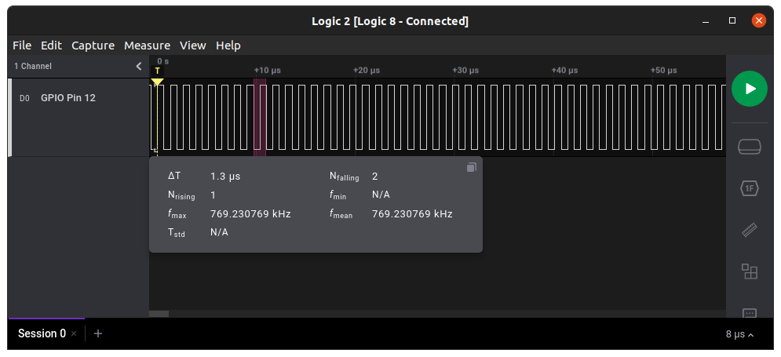

# Quick introduction to libgpiod

The old way of accessing GPIO pins from userspace using `sysfs` has been recently deprecated (see [https://www.kernel.org/doc/html/latest/admin-guide/gpio/sysfs.html](https://www.kernel.org/doc/html/latest/admin-guide/gpio/sysfs.html) for more informations about it).
As a replacement the kernel provides a new userspace ABI in the file `linux/gpio.h`.  

The library `libgpiod` encapsulates the new userspace ABI and provides a lot of functions that are easy to use and powerful.
You can find more informations about the project on the official repository here: [https://git.kernel.org/pub/scm/libs/libgpiod/libgpiod.git/about/](https://git.kernel.org/pub/scm/libs/libgpiod/libgpiod.git/about/).

## Before starting

As of the time of writing (30/12/2021), `libgpiod` is not packaged by default on Raspbian Bullseye, it needs to be installed manually.

```sh
# Install libgpiod for development
sudo apt install libgpiod-dev 
# Install gpiod which provides useful tools
sudo apt install gpiod
```

When distributing programs compiled with this library one needs to be careful to tell the user to also install the library, otherwise the program will not run!  

```sh
# Install the library
sudo apt install libgpiod2
``` 

| Warning                                                       |
| :------------------------------------------------------------ |
| Packages may be named differently on your linux distribution! |

## Basic Use 

The first thing to do before we can have fun with the GPIO pins si to select which GPIO chip we are going to use. 
The package `gpiod` provides a useful tool called `gpiodetect` which gives a detailed list of all GPIO chips present on the device.


In this case the Raspberry Pi 4 has 2 GPIO chips, one from the BCM2711 SoC (`gpiochip0`) where all pins from the header are connected and the second chip where system buttons and leds are connected (`gpiochip1`).

There is also the tool `gpioinfo` which gives a detailed view of all GPIO lines (or pins if you prefer) on each chip.


In this example we are going to make a very simple program that generates a square waveform, basically we are going to set the same pin HIGH then LOW in an infinite loop.

| Note                                                      |
| :-------------------------------------------------------- |
| The code below is not complete and needs to be completed! |


First we need the required headers.

```c
/* We need to include our library */
#include <gpiod.h>
/* This header will help troubleshoot problems and provides the function perror which is very useful */
#include <errno.h>
```

We can now open the GPIO chip and reserve the GPIO line we need.

```c
/* Open gpiochip0 */
struct gpiod_chip *chip = gpiod_chip_open("/dev/gpiochip0");

/* It is of good practice to check whether our calls worked */
/* Later, those checks will be omitted for simplicity's sake, please do not forget them in your code */
if (chip == NULL) {
        perror("unable to open gpiochip0");
        exit(EXIT_FAILURE);
}

/* We will use the GPIO pin 12 */
const unsigned int gpio_pin = 12;

/* Retrieve the GPIO line we want */
struct gpiod_line *line = gpiod_chip_get_line(chip, gpio_pin);

/* Reserve the GPIO line for us, also set the direction to output and set the default output to 0 (LOW) */
/* The argument "consumer" is a string that will appear in gpioinfo, it is used to tell which program is using the line */
gpiod_line_request_output(line, "our example name", 0);
```

At this point, we have reserved the GPIO pin 12 for our program. 
If another process tries to access the pin it will fail as we are already using it.

```c
/* Now we can generate the waveform */
for (;;) {
        /* Set output to LOW */
        gpiod_line_set_value(line, 0);
        /* Set output to HIGH */
        gpiod_line_set_value(line, 1);
}
```

And the final thing that is necessary before we can run it is to release all used lines at the end.

```c
/* Release requested line */
gpiod_line_release(line);
/* Close access to the GPIO chip */
gpiod_chip_close(chip);
```

Using a logic analyzer we can observe the resulting square waveform.



For using a line as an input it is the same thing, open the chip, retrieve a line, reserve the line and set the direction.
You can use `gpiod_line_get_value` this time to read the value of the pin (HIGH or LOW).

As a side note, it is also possible skip the `gpiod_chip_get_line` function altogether by using the function `gpiod_line_get(const char *device, unsgined int offset)`.

| Warning                                                                                  |
| :--------------------------------------------------------------------------------------- |
| However, you **still** need to close the corresponding GPIO chip with `gpiod_chip_close` |

```sh
const int gpio_pin = 12;
struct gpiod_line *line = gpiod_line_get("/dev/gpiochip0", gpio_pin);
```

## Events

The library supports the three possible events on a GPIO line: **rising edge**, **falling edge** and **both edges**.

A small tool is also provided to monitor events on different lines: `gpiomon`.


## Interrupts

As of now the library does not seem to provide a way to have GPIO interrupts.
The simplest way to do it is to utilize the multitasking capabilities of our system and have a thread constantly waiting for events.

A small wrapper is availabe in the folder `rpi/include` and is called `gpiod-isr.h`, it is based on pthread and thus requires to compile with the `-pthread` flag.

## Examples


